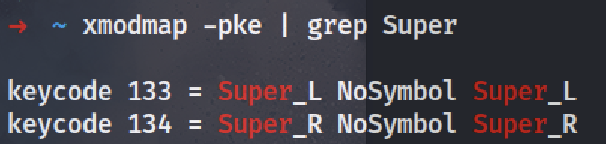

# How to change the default shortcut in Kali Linux using xmodmap?

1. Install xdotool if you haven't already:

```bash
sudo apt-get install xdotool
```

2. We'll use xmodmap to remap Super+C to Ctrl+C:

First, find out the keycode for Super key. You can do this by running:

```bash
xmodmap -pke | grep Super
```

3. Now, create a custom xmodmap file:

```bash
vi ~/.Xmodmap
```

Add the following line to the file:

```bash
keycode XXX = Control_L
```



For example is my Super key is keycode 133, so I'll add:

```bash
clear mod4
keycode 133 = Control_L
add control = Control_L
```

4. Load the custom xmodmap file:

```bash
xmodmap ~/.Xmodmap
```
